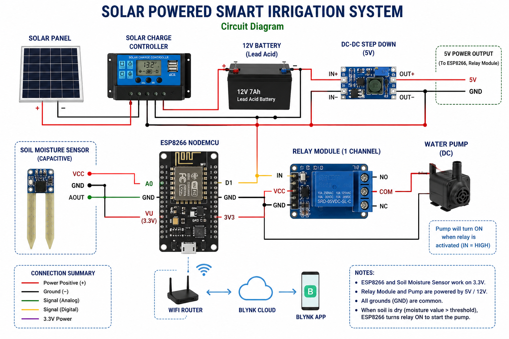
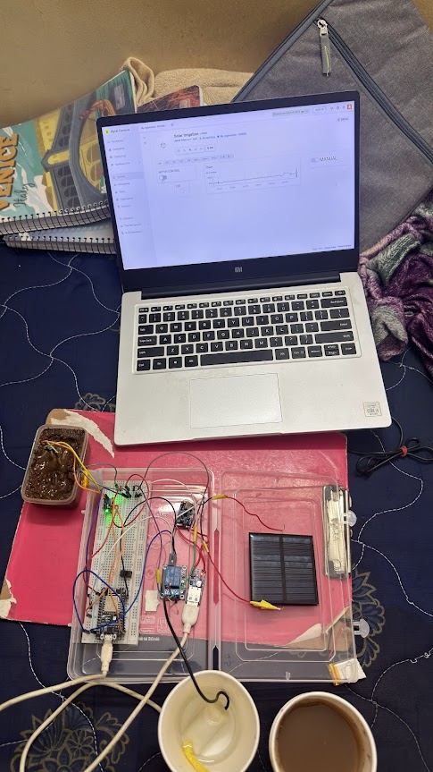

# Solar Powered Smart Irrigation System

An IoT-based automated irrigation system using ESP8266, soil moisture sensors, and solar energy for efficient water management.

---

## Features
## Circuit Diagram



- Automatic irrigation based on soil moisture
- ESP8266-based wireless monitoring
- Solar-powered standalone operation
- Remote control using Blynk
- Real-time sensor monitoring

---

## Components Used

- ESP8266 NodeMCU
- Soil Moisture Sensor
- Relay Module
- Water Pump
- Solar Panel
- Rechargeable Battery
- Jumper Wires

---

## Technologies Used

- Arduino IDE
- Embedded C
- Blynk IoT Platform
- ESP8266 WiFi

---

## Working Principle

The system continuously monitors soil moisture levels using sensors.  
When moisture falls below a threshold value, the ESP8266 activates the water pump automatically through a relay module.  
The system can also be monitored and controlled remotely using the Blynk mobile application.

---
## Workflow

```text
Soil Moisture Sensor
        ↓
ESP8266 NodeMCU
        ↓
Decision Logic
        ↓
Relay Module
        ↓
Water Pump
        ↓
Irrigation Control
        ↓
Blynk Cloud Monitoring
```
## Project Images

### Circuit Diagram


## Technical Specifications

- Controller: ESP8266 NodeMCU
- Sensor: Soil Moisture Sensor
- Communication: WiFi
- Cloud Platform: Blynk
- Power Source: Solar + Battery
- Pump Control: Relay Module

## Future Improvements

- AI-based irrigation prediction
- Weather API integration
- Multi-sensor field monitoring
- Cloud data analytics

---

## Project Status

Completed as part of EE312 project work at IIT Goa.
